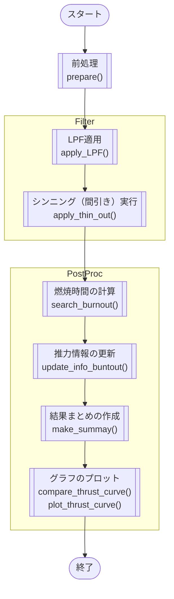

# Outline

# Environment

Python 3.13</br>
encoding UTF-8

# Usage
コマンドプロンプト、ターミナル等で[`main.py`](main.py)を実行する。
```
$ python main.py
```

解析対象のファイル、結果の出力先はmain関数内の引数で指定する。
```
if __name__=='__main__':

    main('example/thrust.csv', 'output/sample')
```
第1引数：解析対象のファイル、第2引数：結果の出力先

# Set up
必要なPythonのライブラリのインストール
```
$ python -m pip install -r requirements.txt
```

# Specification

## Module Specification
|モジュール名|説明|
|--|--|
|main.py    |メインルーチンの実行|
|reader.py  |ファイルの読み出し関数群|
|analyzer.py|データの統計処理、解析|
|grapher.py |グラフのプロット|

## Function Specification
### Main 


|関数名|概要|詳細|
|--|--|--|
|prepare        |前処理        |結果出力用のフォルダ作成、推力履歴の読み込み、推力情報の取得    |
|apply_LPF      |LPFの適用     |推力履歴にLow Pass Filter(LPF)を適用する |
|apply_thin_out |シンニング    |推力の変曲点（極大、極小）を算出し、変曲点ごとにデータを間引く|
|search_burnout |燃焼時間の算出 |後方接線角二等分線と推力カーブの交点から燃焼時間を算出|